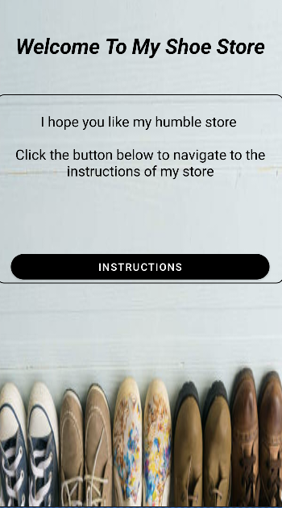
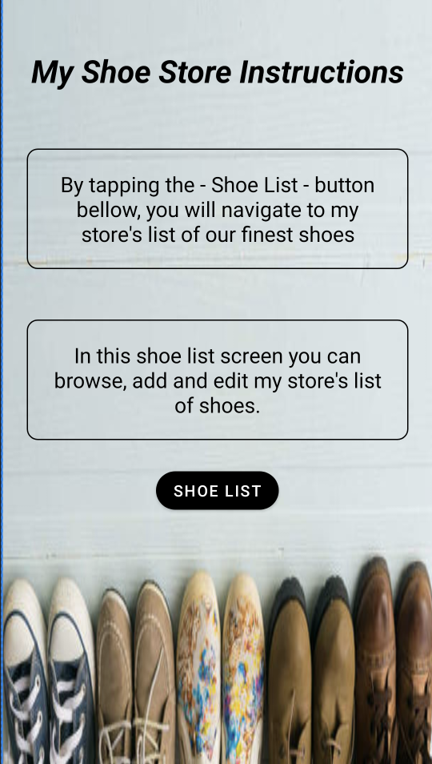
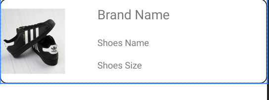
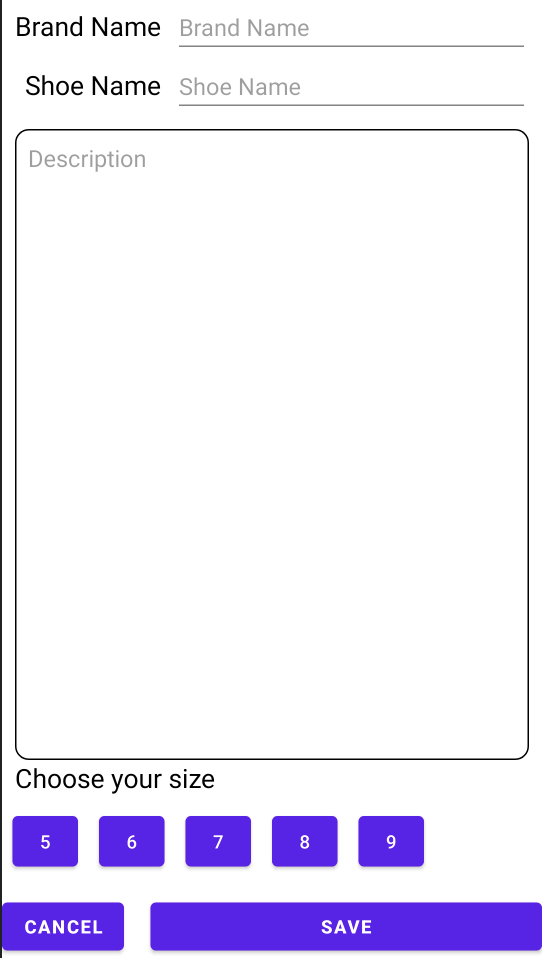

# README

# Shoe Store Apllication

This project is part of Udacity's nanodegree kotlin course.
It is carried out to demonstrate our understanding of views, layouts, constraints, data binding, and many more.

## Walkthrough

This project consists of five screens

1. Login

2. Welcome Onboarding

3. Instructions Onboarding

4. List of Shoes Items

item's layout:

5. Shoe Details

